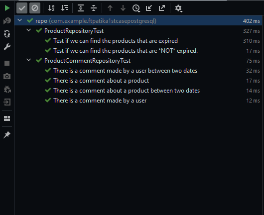

# FT Teknoloji Java Spring Boot Practicum - Patika.dev

### Requirements
#### Repository içinde;
- Bir ürüne ait yorumları listeleyen bir metot yazınız.
- Verilen tarih aralıklarında belirli bir ürüne yapılmış olan yorumları gösteren bir metot yazınız.
- Bir kullanıcının yapmış olduğu yorumları listeleyen bir metot yazınız.
- Bir kullanıcının belirli tarihler aralığında yapmış olduğu yorumları gösteren bir metot yazınız.
- Son kullanma tarihi geçmiş ürünleri listeleyen bir metot yazınız.
- Son kullanma tarihi geçmemiş ürünleri listeleyen bir metot yazınız. (Son kullanma tarihi boş olanlar da gelmeli.)

#### Wrote Unit Tests to satisfy the requirements above.
- For the requirements of ProductComment's, run the tests in the ProductCommentTest class.
  - Test cases; 
      - should_Return_Ok_When_There_Is_A_Comment_Of_A_Product
      - should_Return_Ok_When_There_Is_A_Comment_Of_A_Product_Between_Two_Dates
      - should_Return_Ok_When_There_Is_A_Comment_Of_A_User
      - should_Return_Ok_When_There_Is_A_Comment_Of_A_User_Between_Two_Dates

- For the requirements of Product's, run the tests in the ProductTest class.
  - Test cases;
      - should_Return_Ok_When_There_Is_A_Product_With_Expired_Date
      - should_Return_Ok_When_There_Is_A_Product_With_Not_Expired_Date

#### Test Cases
